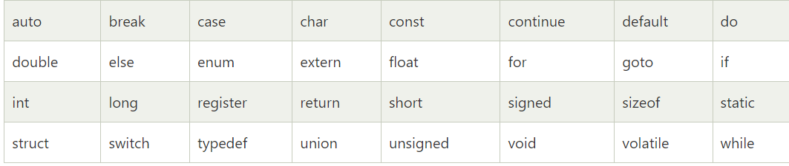

# What going to cover 
  - start with assignment 
  - Ask you they have any doubt 
  - Why we need data types ? 
  - Types of data type in C 
  - Discuss the primary data types 
  - coding 
  - What are the rules for creating a vairable name? 
  - Keywords in C 

# Data types in C 
Data types are used to specify the type of data that a variable can hold. Data types defines the size and formate of the data. 

Data types in C can be classified into - 
  1. Primitive data types 
     - char
     - int
     - float
     - double
  2. Derived Data types 
        - Function
        - Array 
        - Pointer
  3. User Defined Data types  
        - Typedef
        - Enum
        - Structure 
        - Union 

In this lecture we are going to discuss about <b>Primitive data types</b>

The data types in C has occupied memory space in (RAM). 

 | Data types | Bytes | Value Range in decimal |
 | --- | --- | --- |
 | char | 1 byte | -128 to 127 | 
 | int | 2 bytes | -32768 to 32767 |
 | float | 4 bytes | 3.4e-38 to 3.4e + 38 |
 | double | 8 bytes | 1.7e-308 to 1.7e + 308|

 ## Rules for constructing variables names - 
 1. The first character in the variable name must be an alphabet or underscore ( _ ).
 2. No commas or blanks are allowed within a variable name. 
 3. Variable names are case sensitive. 
 4. No special symbol other than underscore ( _ ) are allowed. 
 5. A variable name is any combination of 1 to 31 alphabets, digits, underscores. 
 6. Keywords in c are not considered as variable name. e.g `int auto`; you can't create variable name as `auto` because it is a keyword. 

 ## Keywords in C 
 Keywords in C are reserved words that have predefined meanings in the C programming language. These keywords can't be used as identifiers(such as variable names or function names) because they serve specific purposes within the language. Here is the list of C keywords: 
 
 

